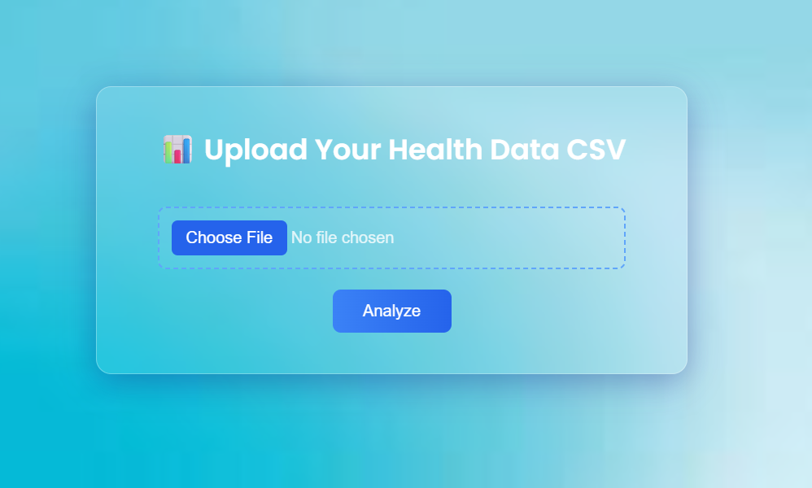
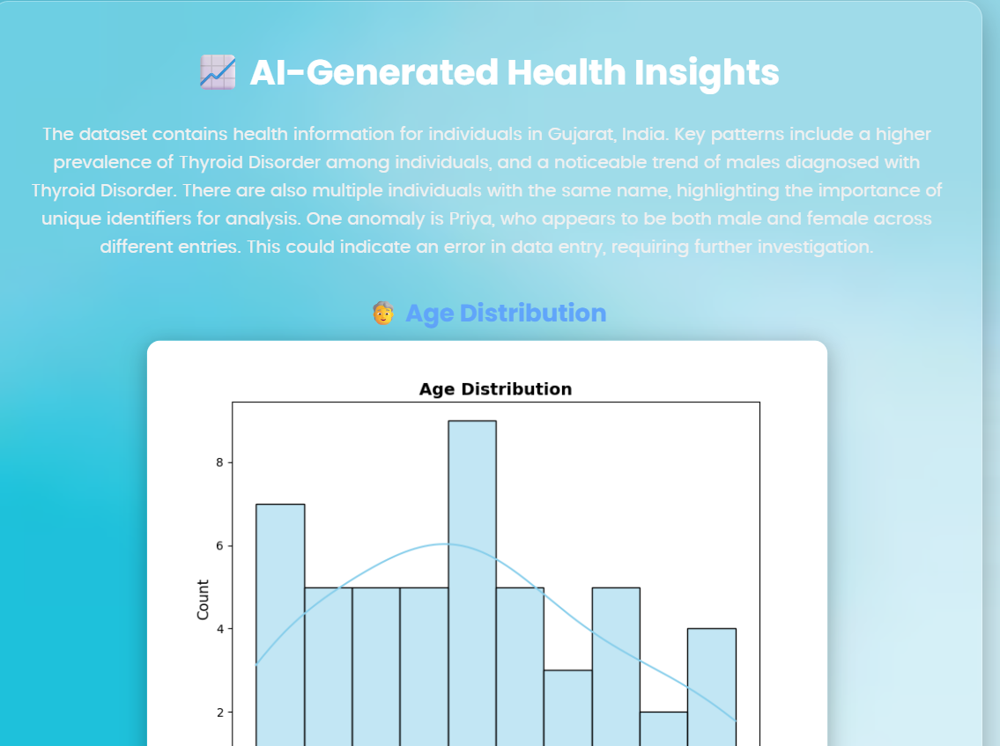

# 🧠 AI-Powered Health Insights Platform

> A data science web app that lets users upload CSV health datasets, automatically analyze the data, generate insights, and visualize key patterns using AI.


## 🚀 Overview

This is a mini end-to-end decision-support tool for healthcare data. Users can upload health records in `.csv` format, and the system will:

* Perform automated data cleaning & preprocessing
* Generate exploratory data analysis (EDA) visuals
* Use AI (Gemini) to produce intelligent insights
* Present results in a modern, responsive UI

---

## 📦 Features

* 🔼 **CSV Upload** with smooth UI
* 🧹 **Data Cleaning** using Pandas
* 📊 **Charts** for age distribution and disease frequency
* 🤖 **LLM Insights** powered by OpenAI API
* 🎨 **Beautiful UI** with glassmorphism and responsive design

---

## 🛠 Tech Stack

| Technology                     | Usage                           |
| ------------------------------ | ------------------------------- |
| Python, Flask                  | Backend                         |
| Pandas, Seaborn, Matplotlib    | Data processing & visualization |
| OpenAI API                     | AI-powered insights             |
| HTML, CSS (Poppins + Glass UI) | Frontend                        |
| Jinja2                         | Template rendering              |

---

## 📂 Folder Structure

```
🔼 static/
│   ├ bgimg.jpg
│   ├ age_distribution.png
│   └ disease_frequency.png
🔼 templates/
│   ├ index.html
│   └ result.html
🔼 app.py
🔼 requirements.txt
🔼 README.md
```

---

## 🔧 Setup Instructions

1. **Clone the Repository**

```bash
git clone https://github.com/Abhi-2516/Data-Science-_Task.git
cd health-insights-ai
```

2. **Install Requirements**

```bash
pip install -r requirements.txt
```

3. **Run the App**

```bash
python app.py
```

4. **Visit in Browser**

```
http://127.0.0.1:5000
```

---

## 📊 Sample Insights

> “Patients aged 45-60 show the highest frequency of heart-related diseases.”
> “Diabetes and hypertension are the most recurring diseases among females aged 30-50.”

---

## 📸 Screenshots

### 📥 Upload Page



### 📈 Results Page



---

## 💡 Future Improvements

* Add Streamlit / Hugging Face deployment
* Use session-based storage for multi-user usage
* Add drag-and-drop support for CSV files
* Export insights to PDF or Excel

---

## 🙌 Acknowledgments

Built for the **DataSense Final Sprint Challenge**.
Top 25 out of 550+ candidates.

---

## 📬 Connect with Me

**Abhishek Yadav**
 • [GitHub](https://github.com/Abhi_2516) • [Email](abhishekyadav2022@vitbhopal.ac.in)
